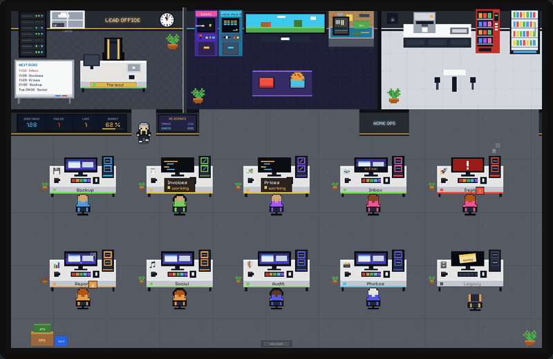

# pixel-openspace

**Un open space en pixel art où tes tâches planifiées et tes agents IA viennent travailler.**

Chaque agent a son bureau. Celui qui tourne s'assoit et tape, l'écran allumé. Les désœuvrés vont au café, aux bornes d'arcade ou chez un collègue. Le PC d'une tâche en échec se met à fumer, et le chef vient s'asseoir à côté jusqu'à ce qu'elle reparte. Les retardataires somnolent ; les oubliés voient leur plante faner et la poussière couvrir leur écran.

**[Essayer la démo en ligne](https://pixel-openspace.vercel.app/fr)** · [🇬🇧 Read in English](./README.md)



Deux façons de s'en servir :

- **Dans ton appli** : un composant [shadcn/ui](https://ui.shadcn.com) pour Next.js et React. Le code est copié dans ton projet, habillé par tes propres `Button` et `Card`, et c'est toi qui lui passes tes tâches.
- **Sans écrire de code** : un petit serveur local qui lit les tâches déjà planifiées sur ta machine (launchd, cron, timers systemd) et ouvre leur open space dans ton navigateur.

## Dans ton appli

### Installer

Dans un projet où shadcn/ui est en place :

```bash
npx shadcn@latest add https://raw.githubusercontent.com/leduss/pixel-openspace/main/public/r/pixel-openspace.json
```

Les fichiers arrivent dans `components/pixel-openspace/`. Les étiquettes de la scène utilisent [Pixelify Sans](https://fonts.google.com/specimen/Pixelify+Sans) par la variable CSS `--font-pixel` ; avec Next.js :

```tsx
// app/layout.tsx
import { Pixelify_Sans } from 'next/font/google'
const pixel = Pixelify_Sans({ variable: '--font-pixel', subsets: ['latin'] })
// …et ajoute pixel.variable au className de <html>
```

### Mettre à jour

Le code vit dans ton projet : mettre à jour, c'est relancer la même commande avec `--overwrite`. Tes retouches dans `components/pixel-openspace/` sont remplacées. Ce qui a changé est dans le [journal des versions](./CHANGELOG.fr.md).

```bash
npx shadcn@latest add https://raw.githubusercontent.com/leduss/pixel-openspace/main/public/r/pixel-openspace.json --overwrite
```

### Utiliser

```tsx
'use client'

import { PixelOpenspace } from '@/components/pixel-openspace/pixel-openspace'

export function Bureau() {
  return (
    <PixelOpenspace
      language="fr"
      agents={[
        { id: 'sauvegarde', name: 'Sauvegarde', emoji: '💾', status: 'ok', schedule: 'chaque jour à 2 h 30', nextRun: '2026-10-04T02:30:00Z' },
        { id: 'deploiement', name: 'Déploiement', emoji: '🚀', status: 'failed', lastMessage: 'échec de la compilation : erreur de type' },
        { id: 'boite', name: 'Boîte mail', emoji: '📨', status: 'working', role: 'Trie les mails du support avec un LLM' },
      ]}
      wall={[{ label: 'Tâches du jour', value: 128, tone: 'info' }]}
      weather={{ temperature: 19, sky: 'clouds', day: true, place: 'Lanton' }}
      onRun={(agent) => fetch(`/api/taches/${agent.id}/lancer`, { method: 'POST' })}
    />
  )
}
```

Le composant suit ses props : la salle se redessine à partir de ce que tu lui passes.

### Lui donner tes tâches

Expose l'état de tes tâches, relis-le toutes les quelques secondes et passe-le au composant. Quand un état change, la salle réagit : la tâche s'assoit pour travailler, ou se lève, s'étire et dit sa dernière ligne de journal dans une bulle. Les deux fichiers ci-dessous servent de point de départ : une route d'API qui lit tes tâches, et une page qui la relit.

```ts
// app/api/jobs/route.ts
export async function GET() {
  const jobs = await db.job.findMany()
  return Response.json(
    jobs.map((job) => ({
      id: job.id,
      name: job.name,
      emoji: job.emoji,
      status: job.running ? 'working' : job.lastExitCode ? 'failed' : 'ok',
      lastRun: job.lastRunAt,
      nextRun: job.nextRunAt,
      lastMessage: job.lastLogLine,
    })),
  )
}
```

```tsx
// app/office/page.tsx
'use client'

import { useEffect, useState } from 'react'
import { PixelOpenspace } from '@/components/pixel-openspace/pixel-openspace'
import type { Agent } from '@/components/pixel-openspace/types'

export default function Office() {
  const [agents, setAgents] = useState<Agent[]>([])

  useEffect(() => {
    const load = () => fetch('/api/jobs').then((r) => r.json()).then(setAgents)
    load()
    const timer = setInterval(load, 5000)
    return () => clearInterval(timer)
  }, [])

  return (
    <PixelOpenspace
      agents={agents}
      onRun={(agent) => fetch(`/api/jobs/${agent.id}/run`, { method: 'POST' })}
    />
  )
}
```

### Les états d'un agent

| `status` | Dans la salle |
| --- | --- |
| `working` | À son bureau, il tape, le code défile sur son écran |
| `ok` | À jour : il va au café, aux bornes d'arcade, sur le canapé… |
| `late` | Il somnole à son bureau |
| `failed` | Écran rouge, PC qui fume ; le chef vient rester à côté de lui |
| `off` | Chaise vide, un post-it sur l'écran éteint |
| `never` | Jamais lancé |
| `on-demand` | Ne tourne que quand on le lui demande |

### Les props

| Prop | Type | |
| --- | --- | --- |
| `agents` | `Agent[]` | Cinq bureaux par rangée, des rangées ajoutées au besoin |
| `lead` | `Agent` | Le chef, dans le bureau vitré ; un chef de décor s'y installe si tu n'en donnes pas |
| `title` | `string` | L'enseigne au mur de la grande salle |
| `wall` | `WallTile[]` | Jusqu'à quatre tuiles sur le grand écran mural (`label`, `value`, `tone`, `progress`) |
| `announcements` | `string[]` | Ce que le chef annonce devant l'écran mural après sa tournée |
| `weather` | `Weather \| null` | Le ciel derrière la fenêtre du chef : `clear`, `clouds`, `fog`, `rain`, `snow`, `storm` |
| `visitors` | `number` | Un compteur : chaque fois qu'il monte, un visiteur entre saluer le chef |
| `deliveries` | `number` | Un compteur : chaque fois qu'il monte, un livreur dépose un colis près des cartons |
| `celebrate` | `boolean` | Des confettis sur toute la salle |
| `timeline` | `boolean` | La frise de la journée sous la salle, un point par passage, quand les agents ont des `runs` (`true` par défaut) |
| `language` | `'en' \| 'fr'` | Tout ce qui s'écrit et se dit dans la salle |
| `theme` | `'geek' \| 'eighties' \| 'gym' \| 'modern' \| 'kitchen'` | L'allure de la salle (`'geek'` par défaut, voir plus bas) |
| `seasonal` | `boolean` | Halloween tout octobre, Noël tout décembre, Pâques les deux semaines avant le lundi de Pâques (`true` par défaut) |
| `nightHours` | `[number, number]` | Les heures où chacun reste à son bureau (`[22, 6]` par défaut) |
| `toolbar` | `boolean` | Le bouton du plein écran et la roue dentée des réglages (`true` par défaut) |
| `objectLinks` | `Partial<Record<SceneObject, string>>` | Rend cliquables l'établi, la télé, la baie de serveurs, le distributeur, le frigo ou les cartons |
| `onObjectClick` | `(object, href) => void` | Appelé au lieu de suivre le lien, pour les routeurs côté client |
| `onRun` | `(agent) => void \| Promise<void>` | Affiche un bouton « Lancer » sur la fiche de chaque agent |
| `now` | `number` | L'heure, pour un rendu côté serveur ; sans elle, la scène se dessine une fois dans le navigateur |

Chaque `Agent` a un `id`, un `name`, un `status`, et au choix un `emoji`, un `role`, un `schedule`, `lastMessage`, `lastRun`, `nextRun` (son écran fait le compte à rebours des dix dernières minutes), `staleAfterHours` (72 par défaut : passé ce délai sans passage, sa plante fane) et `runs`, les passages du jour sous la forme `{ at, ok, message }` pour la frise.

## Sans écrire de code

Le dossier `cli/` contient un petit serveur qui trouve les tâches planifiées sur ta machine et les montre dans l'open space :

- **launchd** (macOS) : tes agents de `~/Library/LaunchAgents` qui tournent selon un horaire. En cours ou non, dernier code de sortie, dernière ligne de leur journal.
- **cron** : ta crontab. cron ne garde pas d'historique : chaque passage est supposé avoir eu lieu à l'heure.
- **systemd** (Linux) : tes timers utilisateur, avec le résultat de leur dernier passage et la dernière ligne de leur journal.

Une seule commande, avec Node.js 18.3 ou plus récent :

```bash
npx pixel-openspace --match sauvegarde --theme modern
```

Le serveur n'écoute que sur `127.0.0.1:4747` et ouvre ton navigateur. Les options utiles :

| Option | |
| --- | --- |
| `-m, --match <texte>` | Ne montre que les tâches dont le nom contient ce texte (répétable). Fait aussi entrer les services sans horaire |
| `-x, --exclude <texte>` | Cache les tâches dont le nom contient ce texte (répétable) |
| `-t, --theme <nom>` | `geek`, `eighties`, `gym`, `modern` ou `kitchen` ; `?theme=gym` dans l'adresse marche aussi |
| `-l, --lang <en\|fr>` | La langue de la salle (par défaut, celle du système) |
| `-w, --weather <lieu>` | La vraie météo derrière la fenêtre du chef, par [Open-Meteo](https://open-meteo.com) : une ville ou `latitude,longitude` |
| `--allow-run` | Laisse le bouton « Lancer » démarrer une tâche (`launchctl kickstart`, `systemctl start`) ; désactivé par défaut |
| `--json` | Affiche les tâches trouvées et s'arrête |

Toutes les options peuvent aussi aller dans un fichier `pixel-openspace.json`, dans le dossier courant ou dans `~/.config/pixel-openspace/config.json`, avec pour chaque tâche un nom, un emoji ou une description plus parlants :

```json
{
  "title": "MON ATELIER",
  "theme": "eighties",
  "language": "fr",
  "weather": "Lanton",
  "match": ["atelier"],
  "agents": {
    "fr.atelier.sauvegarde": { "name": "Sauvegarde", "emoji": "💾", "role": "Sauvegarde la base sur S3" },
    "fr.atelier.vieille-synchro": { "hidden": true }
  }
}
```

## Ce qu'il y a d'autre dans la salle

- Cinq thèmes : un open space geek aux tours RGB (`geek`), un bureau d'entreprise de 1986, lambris et écrans cathodiques vert phosphore (`eighties`), une salle de sport où chaque tâche pédale sur son vélo (`gym`), et un bureau moderne et lumineux, chêne clair, portables, bureaux assis-debout et table de ping-pong (`modern`), et une cuisine de restaurant où chaque tâche cuisine à son piano et où celle qui plante fait brûler sa poêle (`kitchen`).
- Deux bornes d'arcade jouables, **Snake des composants** et **Casse-puces**, avec leurs records au mur.
- Un tableau blanc avec les cinq prochains passages, une horloge à l'heure, le chat de l'atelier qui dort sur les bureaux vides.
- Les saisons : Halloween tout octobre, Noël tout décembre, et Pâques les deux semaines avant le lundi de Pâques, avec ses œufs cachés et son lapin.
- Le jour et la nuit : la salle s'assombrit le soir, et les tours RGB, les néons, les lampes et les écrans s'allument.
- Une roue dentée de réglages : qui regarde la salle renomme l'enseigne au mur, choisit la ville dont la vraie météo s'affiche à la fenêtre (par [Open-Meteo](https://open-meteo.com), sans clé), le thème et la langue, active le son 8 bits et les alertes du navigateur, coupe les saisons, la nuit, les allées et venues ou la frise de la journée. Ses choix restent dans son navigateur et passent avant les props.
- Une notification du navigateur quand un agent tombe en échec, et un son 8 bits pour les départs, les échecs et les visiteurs (à activer).
- `prefers-reduced-motion` est respecté : tout le monde reste à sa place.

## Léger pour le processeur

La page est faite pour rester ouverte toute la journée sur un écran à côté. La boucle tourne à 30 images par seconde et ne redessine que ce qui a changé. Les animations du décor sont pilotées par cette boucle, pas par les animations SVG du navigateur. Au bout de 20 secondes de calme, la scène se fige ; la nuit, chacun reste à son bureau.

## Développer

```bash
bun install
bun dev                  # la démo, sur http://localhost:3000
bun run test             # le moteur des déplacements, les saisons, les horaires
bun run registry:build   # reconstruit public/r/pixel-openspace.json
bun run cli:build        # construit le serveur local dans cli/dist
```

Le composant vit dans `registry/pixel-openspace/`, le serveur local dans `cli/`, la landing dans `src/`.

## D'où ça vient

Né dans l'atelier de [Monte Ma Tour](https://montematour.fr), montage de PC sur mesure sur le Bassin d'Arcachon, pour garder un œil sur les tâches qui font tourner l'activité. Le code parle français à l'intérieur : c'est là qu'il a grandi.

## Soutenir

Si pixel-openspace égaie ton écran, tu peux [m'offrir un café](https://buymeacoffee.com/leduss) ☕. Ça paie les heures passées à dessiner de nouveaux thèmes.

<a href="https://buymeacoffee.com/leduss"></a>

## Licence

[MIT](./LICENSE)
