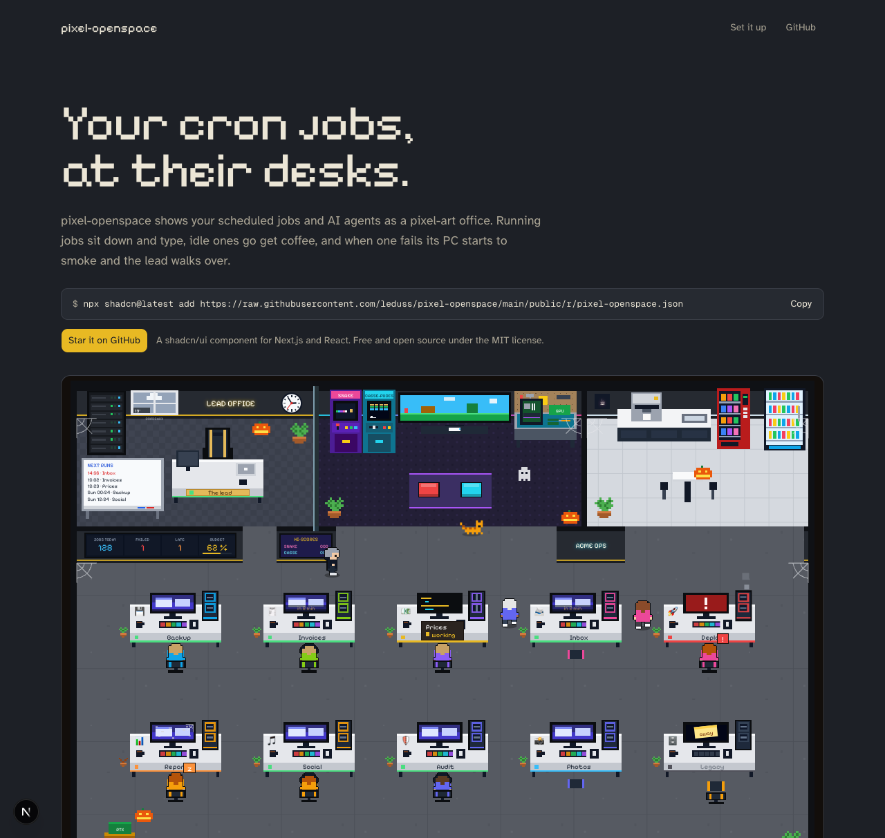

# pixel-openspace

**A pixel-art open space where your scheduled jobs and AI agents come to work.**

Every agent gets a desk. Whoever is running sits down and types, screen lit up. Idle ones wander off to the coffee machine, the arcade cabinets or a colleague’s desk. A failed job’s PC starts smoking and the lead walks over and stays until it recovers. Late ones doze, forgotten ones see their plant wilt and dust settle on their screen.

[🇫🇷 Lire en français](./README.fr.md)



It is a [shadcn/ui](https://ui.shadcn.com) component for Next.js and React: the code is copied into your project, styled by your own `Button` and `Card`.

## Install

In a project with shadcn/ui set up:

```bash
npx shadcn@latest add https://raw.githubusercontent.com/leduss/pixel-openspace/main/public/r/pixel-openspace.json
```

The files land in `components/pixel-openspace/`. The labels in the room use [Pixelify Sans](https://fonts.google.com/specimen/Pixelify+Sans) through a `--font-pixel` CSS variable; with Next.js:

```tsx
// app/layout.tsx
import { Pixelify_Sans } from 'next/font/google'
const pixel = Pixelify_Sans({ variable: '--font-pixel', subsets: ['latin'] })
// …and add pixel.variable to <html className>
```

## Use

```tsx
'use client'

import { PixelOpenspace } from '@/components/pixel-openspace/pixel-openspace'

export function Office() {
  return (
    <PixelOpenspace
      agents={[
        { id: 'backup', name: 'Backup', emoji: '💾', status: 'ok', schedule: 'daily at 2:30', nextRun: '2026-10-04T02:30:00Z' },
        { id: 'deploy', name: 'Deploy', emoji: '🚀', status: 'failed', lastMessage: 'build failed: type error' },
        { id: 'inbox', name: 'Inbox', emoji: '📨', status: 'working', role: 'Triages the support inbox with an LLM' },
      ]}
      wall={[{ label: 'Jobs today', value: 128, tone: 'info' }]}
      weather={{ temperature: 19, sky: 'clouds', day: true, place: 'Bordeaux' }}
      onRun={(agent) => fetch(`/api/jobs/${agent.id}/run`, { method: 'POST' })}
    />
  )
}
```

The component is driven by its props: poll your jobs’ state (every few seconds is plenty) and pass it down. The room reacts to the changes: whoever starts working sits down, whoever finishes stretches and says its `lastMessage` in a speech bubble.

### Agent statuses

| `status` | In the room |
| --- | --- |
| `working` | At its desk, typing, code scrolling on its screen, RGB keyboard and fans on |
| `ok` | Up to date: wanders to the coffee machine, the arcade, the bean bags… |
| `late` | Dozes at its desk |
| `failed` | Red screen, smoking PC; the lead comes and stays by its side |
| `off` | Empty chair, a post-it on a dark screen |
| `never` | Never ran yet |
| `on-demand` | Only runs when asked |

### Props

| Prop | Type | |
| --- | --- | --- |
| `agents` | `Agent[]` | Five desks per row, rows added as needed |
| `lead` | `Agent` | The lead in the glass office; a decorative one sits there if none is given |
| `title` | `string` | The neon sign on the main room wall |
| `wall` | `WallTile[]` | Up to four tiles on the big wall screen (`label`, `value`, `tone`, `progress`) |
| `announcements` | `string[]` | What the lead announces in front of the wall screen after its rounds |
| `weather` | `Weather \| null` | The sky behind the lead’s window: `clear`, `clouds`, `fog`, `rain`, `snow`, `storm` |
| `visitors` | `number` | A counter: each time it goes up, a visitor walks in to greet the lead |
| `deliveries` | `number` | A counter: each time it goes up, a courier drops a parcel by the boxes |
| `celebrate` | `boolean` | Confetti over the whole room |
| `language` | `'en' \| 'fr'` | Everything written and said in the room |
| `theme` | `'geek' \| 'eighties' \| 'gym'` | The look of the room: a geek open space with RGB towers, a 1986 corporate office with green-phosphor CRTs, or a gym where every job rides an exercise bike (default `'geek'`) |
| `seasonal` | `boolean` | Halloween all October, Christmas all December, Easter for the two weeks before Easter Monday (default `true`) |
| `nightHours` | `[number, number]` | When everybody stays at their desk (default `[22, 6]`) |
| `toolbar` | `boolean` | Sound, browser alerts and fullscreen buttons (default `true`) |
| `objectLinks` | `Partial<Record<SceneObject, string>>` | Make the workbench, TV, server rack, vending machine, fridge or parts boxes clickable |
| `onObjectClick` | `(object, href) => void` | Called instead of following the link, for client-side routers |
| `onRun` | `(agent) => void \| Promise<void>` | Shows a “Run now” button on each agent’s card |
| `now` | `number` | The current time, to render on the server; without it the scene draws once in the browser |

Each `Agent` has an `id`, a `name`, a `status`, and optionally an `emoji`, a `role`, a `schedule`, `lastMessage`, `lastRun`, `nextRun` (its screen counts down the last ten minutes) and `staleAfterHours` (72 by default: after that without a run, its plant wilts).

## What else is in the room

- Two playable arcade cabinets, **Component Snake** and **Chip Breaker**, with their high scores on the wall.
- A whiteboard with the next five runs, a real-time clock, the office cat napping on empty desks.
- Day and night: the room darkens in the evening, and the RGB towers, neon signs and screens glow.
- Browser notifications when an agent fails, and an 8-bit sound for starts, failures and visitors (both opt-in).
- `prefers-reduced-motion` is respected: everybody stays put.

## Light on the CPU

The page is meant to stay open all day on a side screen. The loop runs at 30 fps and only redraws what changed. The decorative animations are driven by that loop, not by the browser’s SVG animations. After 20 calm seconds the scene freezes, and at night everybody stays at their desk.

## Develop

```bash
bun install
bun dev                  # the demo, on http://localhost:3000
bun run test             # the movement engine
bun run registry:build   # rebuilds public/r/pixel-openspace.json
```

The component lives in `registry/pixel-openspace/`; the demo in `src/`.

## Credits

Born in the workshop of [Monte Ma Tour](https://montematour.fr), a custom PC builder on the Bassin d’Arcachon, to keep an eye on the jobs running the business. The code speaks French inside: that is where it grew up.

## License

[MIT](./LICENSE)
